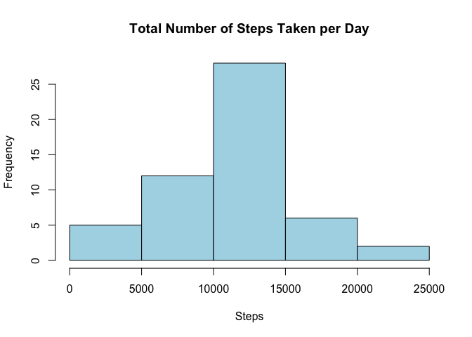
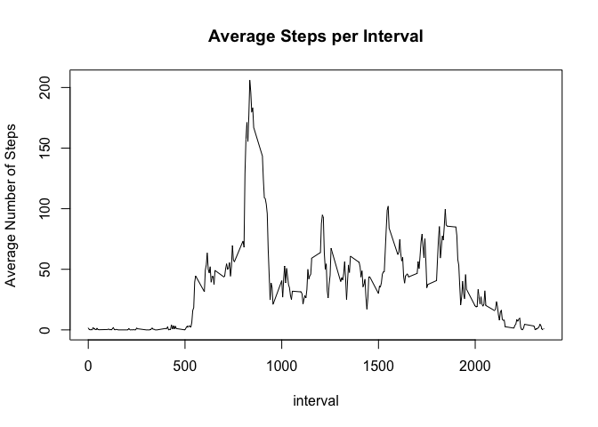
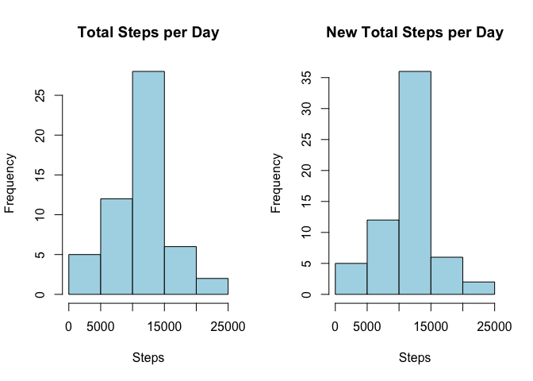
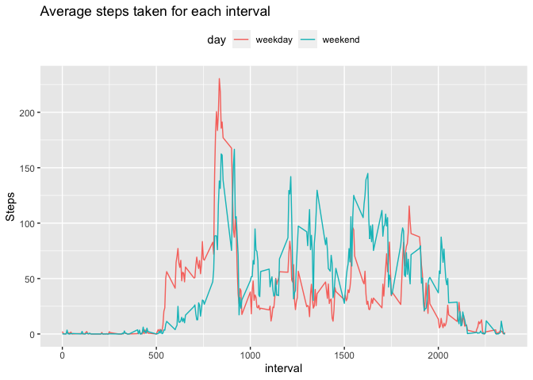

By Jaimie Choi 
May 5, 2020


## Loading and preprocessing the data

```r
#load necessary libraries
library(knitr)
library(dplyr)
```

```
## 
## Attaching package: 'dplyr'
```

```
## The following objects are masked from 'package:stats':
## 
##     filter, lag
```

```
## The following objects are masked from 'package:base':
## 
##     intersect, setdiff, setequal, union
```

```r
library(ggplot2)
#load data
df <- read.table(unzip("activity.zip"), header = TRUE, sep = ",")
#convert the dates from factors to a date object
df$date <- as.Date(as.character(df$date), "%Y-%m-%d")
#remove rows with NA
df_c <- na.omit(df)
kable(head(df_c))
```

       steps  date          interval
----  ------  -----------  ---------
289        0  2012-10-02           0
290        0  2012-10-02           5
291        0  2012-10-02          10
292        0  2012-10-02          15
293        0  2012-10-02          20
294        0  2012-10-02          25


## What is the mean total number of steps taken per day?

```r
# Create a dataset that shows the total number of steps for each day
total <- df_c %>% 
    group_by(date) %>%
    summarize(total_steps = sum(steps))
kable(head(total))
```


date          total_steps
-----------  ------------
2012-10-02            126
2012-10-03          11352
2012-10-04          12116
2012-10-05          13294
2012-10-06          15420
2012-10-07          11015

```r
#Histogram
hist(total$total_steps,
     col = "light blue",
     main = "Total Number of Steps Taken per Day",
     xlab = "Steps")
```

<!-- -->

```r
#Calculation of the mean and median
tmean <- mean(total$total_steps)
tmean <- format(round(tmean,2), nsmall=2)
tmed <- median(total$total_steps)
```

The mean and median of the total number of steps taken per day are 10766.19 and 10765 respectively.

## What is the average daily activity pattern?


```r
#Calculate the average steps per interval
avg <- df_c %>% 
     group_by(interval) %>%
     summarize(avg_steps = mean(steps))
```

```r
#plot the average steps per interval ocross all days
with(avg, plot(interval, avg_steps,
               type = "l",
               main = "Average Steps per Interval",
               ylab = "Average Number of Steps"))
```

<!-- -->

```r
max <- avg[avg$avg_steps == max(avg$avg_steps),]$interval
```
The 5-minute interval with the greatest number of steps is: 835.

## Imputing missing values

```r
#Calculation of the number of missing values
s <- sum(is.na(df))
perc <- mean(is.na(df$steps)) * 100 
perc <- format(round(perc,2), nsmall=2)
```
There are 2304 amount of missing values in this data. These values are only found in the steps column.
So, 13.11 % rows of the steps column has missing values.

```r
#Replace missing values with the average steps per interval.
df_new <- df %>% 
    group_by(interval) %>%
    mutate(steps = replace(steps, is.na(steps), mean(steps, na.rm = TRUE)))
kable(head(df))
```


 steps  date          interval
------  -----------  ---------
    NA  2012-10-01           0
    NA  2012-10-01           5
    NA  2012-10-01          10
    NA  2012-10-01          15
    NA  2012-10-01          20
    NA  2012-10-01          25


```r
# Update dataset that shows the total number of steps for each day
total_new <- df_new %>% 
    group_by(date) %>%
    summarize(total_steps = sum(steps))
```


```r
#Updated histogram
par(mfrow = c(1,2))

hgA <- hist(total$total_steps,
     col = "light blue",
     main = "Total Steps per Day",
     xlab = "Steps")

hgB <- hist(total_new$total_steps,
     col = "light blue",
     main = "New Total Steps per Day",
     xlab = "Steps")
```

<!-- -->


```r
#Calculation of the mean and median
tmean_new <- mean(total_new$total_steps)
tmean_new <- format(round(tmean_new,2), nsmall=2)
tmed_new <- median(total_new$total_steps)
tmed_new <- format(round(tmed_new,2), nsmall=2)
mean_diff <- as.numeric(tmean_new) - as.numeric(tmean)
med_diff <- as.numeric(tmed_new) - tmed
```
After filling the missing values with the average step for the specific interval,
the new mean and median total step per day are 10766.19 and 10766.19.
The new and old mean difference is 0.
The new and old median difference is 1.19.

## Are there differences in activity patterns between weekdays and weekends?

```r
#Creates a new factor variable in the dataset with two levels - "weekday" and "weekend"
df_new$day <- factor(weekdays(df_new$date))
levels(df_new$day) <- list(weekday = c("Monday", "Tuesday", "Wednesday", "Thursday", "Friday"),
                           weekend = c("Saturday","Sunday"))
table(df_new$day)
```

```
## 
## weekday weekend 
##   12960    4608
```


```r
#Time series plot of the 5-minute interval (x-axis) and the average number of steps taken, averaged across all weekday days or weekend days(y-axis)
avg_sep <- df_new %>% 
     group_by(day, interval) %>%
     summarize(avg_steps = mean(steps))

#ggplot(avg_sep[avg_sep$day == "weekday",], plot(interval, avg_steps), type = "l")

ggplot(data = avg_sep, 
    aes(x=interval, y=avg_steps, group = day)) +
    geom_line(aes(color=day)) + 
    theme(legend.position = "top") +
    ggtitle("Average steps taken for each interval") +
    ylab("Steps")
```

<!-- -->
